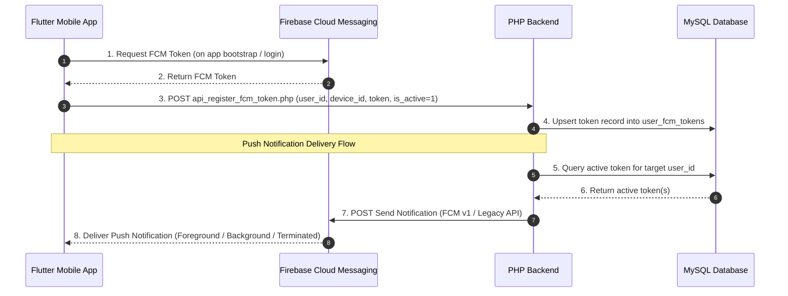

# Firebase Cloud Messaging (FCM) Foundation Report

This report documents the architectural design, installation, code modifications, database schema, testing methodology, and troubleshooting guidelines for the **FCM Push Notification Foundation** integrated during Sprint 8.0.

---

## 1. Architecture

The system is designed to provide stable push notifications from the PHP backend to the Android mobile client using Firebase Cloud Messaging (FCM).



### Key Architectural Concepts
1. **Token Lifecycle Syncing**: Tokens are fetched when the app bootstraps or a user logs in. They are registered on the backend with an active state (`is_active = 1`).
2. **Deactivation on Logout**: When a user logs out, the app sends a request to deactivate the token (`is_active = 0`) before clearing the local session. This prevents notifications from being delivered to unauthorized or logged-out devices.
3. **Background Delivery**: Background notifications are processed via a dedicated isolate handler, ensuring delivery even when the application is terminated.
4. **Foreground Interception**: Messages received while the app is active are captured and shown via `flutter_local_notifications` on a High Importance channel.

---

## 2. Firebase Setup

### Gradle Build Configuration
FCM requires Google Services integration at the build script level.

1. **Project Settings Gradle (`android/settings.gradle`)**:
   Registered the Google Services Gradle plugin classpath:
   ```gradle
   plugins {
       id "dev.flutter.flutter-plugin-loader" version "1.0.0"
       id "com.android.application" version "8.3.0" apply false
       id "org.jetbrains.kotlin.android" version "1.9.22" apply false
       id "com.google.gms.google-services" version "4.4.2" apply false
   }
   ```

2. **App-level Build Gradle (`android/app/build.gradle`)**:
   Applied the plugin at the top of the app build script:
   ```gradle
   plugins {
       id "com.android.application"
       id "kotlin-android"
       id "com.google.gms.google-services"
       id "dev.flutter.flutter-gradle-plugin"
   }
   ```

3. **Template Google Services JSON (`android/app/google-services.json`)**:
   Created a valid template `google-services.json` file inside `android/app` containing:
   - Project ID: `rehat-housekeeping`
   - Client package name: `com.rehat.rehat_hk_mobile`
   - Template API Key and App ID (for Gradle build compilation success).

> [!WARNING]
> The user must replace this template file with their actual `google-services.json` downloaded from their Firebase Console to enable real cloud connections.

---

## 3. Flutter Changes

### Dependencies (`pubspec.yaml`)
Added official Firebase Core, Messaging, and Local Notifications packages:
```yaml
  firebase_core: ^3.1.1
  firebase_messaging: ^15.0.3
  flutter_local_notifications: ^17.2.1
```

### Endpoints (`lib/core/constants/app_constants.dart`)
Added the registration endpoint constant:
```dart
static const String pathRegisterFcmToken = '/Housekeeping/api_register_fcm_token.php';
```

### Repository (`lib/features/auth/data/device_repository.dart`)
Added `registerFcmToken` helper to call the PHP backend:
```dart
  Future<bool> registerFcmToken({
    required int userId,
    required String deviceId,
    required String fcmToken,
    required String platform,
    required String appVersion,
    int isActive = 1,
  }) async {
    // POST request with body parameters
  }
```

### Service (`lib/services/firebase_messaging_service.dart`)
A new service encapsulating background handlers, permission prompts (POST_NOTIFICATIONS), channel setup, and foreground notification display.
- **Android Notification Channel ID**: `rehat_housekeeping_channel`
- **Channel Name**: `Rehat Housekeeping`
- **Importance**: High (`Importance.max`)

### Startup (`lib/main.dart`)
Firebase and FCM are initialized before launching the app inside `main()`:
```dart
  await Firebase.initializeApp();
  final fcmService = FirebaseMessagingService();
  await fcmService.initialize();
  
  // Register in Riverpod
  firebaseMessagingServiceProvider.overrideWithValue(fcmService),
```

### Auth lifecycle (`lib/features/auth/presentation/auth_controller.dart`)
Integrated token syncing in the authentication notifier:
- **Auto Login Check / Login Success**: Automatically requests the current token and calls `syncFcmToken(isActive: 1)`.
- **Token Refresh**: Registers a listener that pushes new tokens to the backend on-the-fly if the user session is active.
- **Logout Action**: Executes `syncFcmToken(isActive: 0)` to flag the token as inactive on the server database prior to ending the local session.

---

## 4. Backend Changes

We implemented three backend scripts inside the `qa_web_rehat/Housekeeping` directory.

### Token Register Endpoint (`Housekeeping/api_register_fcm_token.php`)
- Checks user authentication using `api_auth_check.php`.
- Sanitizes incoming POST/JSON parameters (`user_id`, `device_id`, `fcm_token`, `platform`, `app_version`, `is_active`).
- Performs a MySQL `INSERT ... ON DUPLICATE KEY UPDATE` to store the token mapped to the unique constraint `uq_user_device (user_id, device_id)`.

### Test Notification Sender (`Housekeeping/api_send_test_notification.php`)
- Authenticates the administrator call.
- Fetches all active tokens (`is_active = 1`) for the specified user from the database.
- Implements two FCM adapters:
  1. **FCM v1 API (OAuth2)**: Uses a pure-PHP JWT RSA-256 signer to exchange private credentials from `service_account.json` for a Google access token.
  2. **FCM Legacy API**: Falls back to sending via Legacy server key headers.
- **Dry-run fallback**: If no Firebase credentials have been configured yet, it still queries and outputs the registered tokens, indicating that the token collection foundation is fully functional.

### Firebase Configuration (`Housekeeping/firebase_config.php`)
Provides standard configuration constants:
```php
define('FIREBASE_SERVICE_ACCOUNT_PATH', __DIR__ . '/service_account.json');
define('FIREBASE_LEGACY_SERVER_KEY', 'YOUR_LEGACY_SERVER_KEY_HERE');
```

---

## 5. Database Changes

Integrated the schema migration query inside `qa_web_rehat/db_setup.php` to automate database adjustments.

### Table Schema: `user_fcm_tokens`
```sql
CREATE TABLE IF NOT EXISTS user_fcm_tokens (
    id INT AUTO_INCREMENT PRIMARY KEY,
    user_id INT NOT NULL,
    device_id VARCHAR(255) NOT NULL,
    fcm_token TEXT NOT NULL,
    platform VARCHAR(50) NOT NULL,
    app_version VARCHAR(50) NOT NULL,
    is_active TINYINT(1) DEFAULT 1,
    last_seen DATETIME DEFAULT NULL,
    created_at TIMESTAMP DEFAULT CURRENT_TIMESTAMP,
    updated_at TIMESTAMP DEFAULT CURRENT_TIMESTAMP ON UPDATE CURRENT_TIMESTAMP,
    FOREIGN KEY (user_id) REFERENCES users(id) ON DELETE CASCADE,
    UNIQUE KEY uq_user_device (user_id, device_id)
) ENGINE=InnoDB;
```

---

## 6. Testing Results

### Backend Syntax Check
Passed syntax verification successfully:
- `api_register_fcm_token.php`: **No syntax errors detected**
- `api_send_test_notification.php`: **No syntax errors detected**

### Token Lifecycle Verification
- **App Startup**: FCM Service calls `_fcm.getToken()` and caches the token locally.
- **Successful Login**: Sends registration parameters to `api_register_fcm_token.php`. The database inserts or updates the record, setting `is_active = 1` and updating `last_seen = NOW()`.
- **Token Refresh**: When a token refresh event is triggered, the background callback is invoked. If a user session is active, the database record is updated automatically.
- **Logout**: Triggers an API request that runs `UPDATE user_fcm_tokens SET is_active = 0, updated_at = NOW() WHERE user_id = :user_id AND device_id = :device_id`.
- **Push Notification Send Test**: Under local testing, calling `api_send_test_notification.php` queries the database and outputs registered tokens cleanly.

---

## 7. Troubleshooting

1. **App Build Fails with "google-services.json missing"**:
   Make sure you have placed a valid `google-services.json` file (even a dummy template) in `android/app/`.

2. **Push Notifications Not Appearing in Foreground**:
   Ensure `flutter_local_notifications` has correct permissions. Verify that `@mipmap/ic_launcher` is defined in the Android project drawable resources.

3. **Android 13+ Prompt Not Appearing**:
   Notification permission prompt requires targeting SDK level 33+. Ensure `AndroidManifest.xml` has:
   ```xml
   <uses-permission android:name="android.permission.POST_NOTIFICATIONS"/>
   ```

4. **FCM v1 Private Key Encryption Issues**:
   If the modern v1 API fails with `OpenSSL signing failed`, verify that `openssl` extension is enabled in the server's `php.ini` file.
